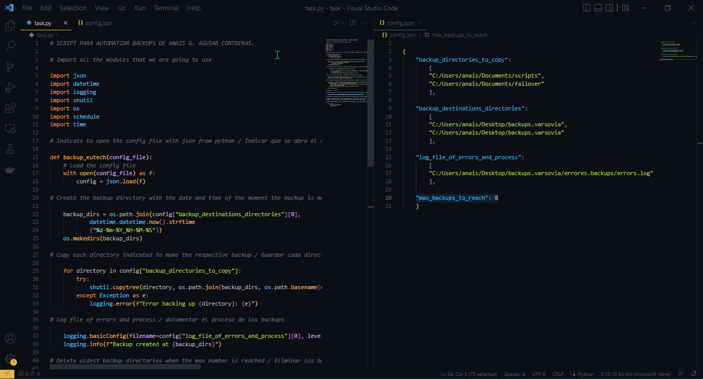

<center>

# Task1: Automate Server Backup Script


</center>

***Author:*** Anais G. Aguiar Contreras.


***Company:*** EUtech Assignments.

***Date:*** 17th March of 2023.

### ÍNDICE

+ [Introduction](#id1)
+ [Requirements](#id2)
+ [Used tools](#id3)
+ [Development](#id4)
+ [Closure](#id5)

<center>

## ***Introduction***. <a name="id1"></a>

</center>

As a system administrator, you are responsible for ensuring that important data on servers is regularly backed up to prevent data loss in case of any disaster. Create a **Python script** that automates the backup process for the server.


We are going to explain step by step how we made the script and how it works.


We have a few requirements that we have to achieve in this script.

<center>

## ***Requirements.*** <a name="id2"></a>

</center>

<br>

• The script should be able to create a backup of all files and directories specified in a configuration file.


• The configuration file should allow specifying multiple directories to be backed up, and where the backups should be stored.


• The script should create a new backup directory for each backup run with the current timestamp in the directory name.


• The script should keep a configurable number of backups and delete the oldest backups when the maximum number is reached.


• The script should log the backup process, including any errors encountered during the backup.


• The script should be runnable as a scheduled task.

<center>

## ***Used tools.*** <a name="id3"></a>

</center>


For this proyect we only needed to use **Python**.

<br>

### ***Development.***. <a name="id4"></a>

<center>

## ***Configuration file.***

</center>

<br>

We needed to create a **configuration file** where you have to specify the directories that you want to copy **(backup_directories_to_copy)** where you want to save the backups **(backup_destinations_directories)**, the maximum of backups that we are going to save in this case it’s 8 **(max_backups_to_reach)**, and where you want to save the logs files **(log_file_of_errors_and_process)**.


Our configuration file looked like that: 


```
{
    "backup_directories_to_copy":
        [
        "C:/Users/anais/Documents/scripts",
        "C:/Users/anais/Documents/failover"
        ],


    "backup_destinations_directories":
        [
        "C:/Users/anais/Desktop/backups.varsovia",
        "C:/Users/anais/Desktop/backups.varsovia"
        ],
   
    "log_file_of_errors_and_process":
        [
        "C:/Users/anais/Desktop/backups.varsovia/errores.backups/errors.log"
        ],
       
    "max_backups_to_reach": 8
    }
```


In this case we used the extension of **“.json”** for the config file to create and work on the configuration file.


After we have created the configuration file, we started with the script.


At the beginning, we imported all the modules that we were going to work with. In this case we used **json, shutil, os, logging, datetime, schedule, time,** these modules gave us all the functions that we needed.

```
import json
import datetime
import logging
import shutil
import os
import schedule
import time
```

In the script we defined the function as **“backup_eutech”** that takes one parameter, **“config_file”**, which is the path to a **JSON** configuration file. The purpose of the function is to load the contents of the configuration file into a dictionary variable called config.


This function is a common approach used to load **JSON** configuration files in Python programs. Once the configuration is loaded, it can be used to set up various parameters and settings used by the program.

```
# Indicar que se abra el archivo con json desde python


def backup_eutech(config_file):
    # Load the config file
    with open(config_file) as f:
        config = json.load(f)
```

<center>

## **Code to create backups of all files and directories specified in configuration file.**

</center>

<br>

This code performs the task of creating backups of directories specified in the **config["backup_directories_to_copy"]** list.


So, in summary, the code takes each directory specified in **config["backup_directories_to_copy"]**, creates a copy of it in a new directory within the backup directory, and logs any errors that occur during the process.

```
# Copy each directory indicated to make the respective backup / Guardar cada directorio que fue copiado en el directorio de backups indicado


    for directory in config["backup_directories_to_copy"]:
        try:
            shutil.copytree(directory, os.path.join(backup_dirs, os.path.basename(directory)))
        except Exception as e:
            logging.error(f"Error backing up {directory}: {e}")
```

<center>

## **Code for that each new backup file created has as its name the date and time of when it was created.**

</center>

<br>

We made the order to have the name of the directory backup the timestamp when it was made. So, the code created a backup directory by joining the first element in a list of backup destinations directories specified in a configuration file **(config["backup_destinations_directories"][0])** with the current date and time, formatted as a string in the format **"d-m-y_h-m-s"** using the **“strftime”** method of the **datetime** module.


In other words, this code created a backup directory with a unique name based on the current date and time, and ensured that the directory is created if it doesn't already exist.

```
# Create the backup directory with the date and time of the moment the backup is made / Creación del directorio de backup con la fecha como nombre


    backup_dirs = os.path.join(config["backup_destinations_directories"][0],
            datetime.datetime.now().strftime
            ("%d-%m-%Y_%H-%M-%S"))
    os.makedirs(backup_dirs)
```

<center>

## **Code to delete the oldest backup if they reached the maximum defined.**

</center>

<br>

To not have a thousands directories of backup we made the order to **delete the oldest backup** that we have (based on its creation date) if the limit is exceeded, it is deleted using the **shutil.rmtree() method**. In this case the **maximum is 8**, the maximum of backups we are going to accept it’s specified in the config file **(config.json)**. The code also logs the deletion of the oldest backup directory. The function returns a list of backup directories.


The **if name == 'main'**: statement checks if the code is being executed as the main program and runs the code inside it.

```
# Delete oldest backup directories when the max number is reached / Eliminar los backup cuando lleguen a un máximo de


    backup_dir = sorted(os.listdir(config["backup_destinations_directories"][0]))
    if len(backup_dir) > int(config["max_backups_to_reach"]):
        oldest_backup = os.path.join(config["backup_destinations_directories"][0], backup_dir[0])
        shutil.rmtree(oldest_backup)
        logging.info(f"Deleted oldest backup at {oldest_backup}")


    return backup_dirs


if __name__ == '__main__':
```

<center>

## **Code to generate a logs to save any errors and process.**

</center>

<br>

We also want to see the errors and the backup process and save it in a different folder, so, the script provides us the archive called **“errors.log”** and we decide if this archive will be created in a folder that we called **“errores.backups”**.


With the code we are **documenting** the process of creating backups, and for debugging **any errors** that might arise during the **backup process**. By logging messages to a file, developers can review the log file to gain insights into the operation of the program and diagnose any issues that may arise. If an error occurs, the except block is executed, which logs an error message using the logging module, indicating which directory failed to be backed up and the specific error that occurred.

```
# Log file of errors and process / documentar el proceso de los backups


    logging.basicConfig(filename=config["log_file_of_errors_and_process"][0], level=logging.INFO)
    logging.info(f"Backup created at {backup_dirs}")
```

<center>

## **Code to make the script runnable as a scheduled task.**

</center>

<br>

We wanted to generate backups automatically and scheduled, for this we used the module **“schedule”** and **“time”** so we can indicate exactly when we want the backup run.

We decided to schedule the backups **every 1 minutes**, if you want to change the time when the backups are generated, you must change the frequency of the backup function to run  in this case it’s **“1”** and the word **"minutes"** by the sequence of time you want (hours, days, years).

You have a couple of examples in the code in case that you want to change the schedule of the backups to be run.

```
# Schedule backup to run every day at the hour that you decide and specify


    schedule.every(1).minutes.do(backup_eutech, config_file='config.json')


# If you want to change the time when the backups are generated, you must change in this case the word "minutes" by the sequence of time you want.


# example: schedule.every(1).hours.do(backup_eutech, config_file='config.json') ----> This will generate backups every 1 hour.
# example: schedule.every(1).days.do(backup_eutech, config_file='config.json') ----> This will generate backups everyday.

```

This code is useful for automating tasks that need to be executed at specific times or intervals, such as data backups or system maintenance. It ensures that these tasks are performed automatically and without human intervention, freeing up time and resources for other important tasks.

To be sure that it will be running automatically at the exact time indicated we need the next two lines in the code that are going to help to check all the schedules that we have to execute.

The **while True** loop runs indefinitely, continuously checking for any pending scheduled tasks and executing them as needed.

The **schedule.run_pending()** function checks if there are any scheduled tasks that need to be executed and runs them.

With these lines in the code we can be sure that it’s going to be executed automatically with the backups scheduled.

```
# Keep running scheduled tasks

    while True:
        schedule.run_pending()
        time.sleep(2)
```

Below you will have video of how the script works and how it is executed, for this example we have programmed a backup to be executed every 2 seconds, you will see the execution and the folders of backups being generate every 2 seconds, also you will see how it'll deleted the oldest backup when it reach the maximum of backups that we specified in the config file, in this case it's 8 and the log of errors and processes were generated to

<br>



<center>

## ***Closure***. <a name="id5"></a>

</center>

<br>

This script is not just a routine task, but an essential process that ensures the protection and longevity of valuable data. With its ability to run automatically, this script offers peace of mind, knowing that critical information is regularly backed up and recoverable in case of any unexpected events. Investing time in creating and maintaining an effective backup script can be the difference between a minor inconvenience and a devastating loss of data. Also you can configurate easily how often do you want the backups and the directories that are important for you to keep safe. It's a simply script but can make your life better.