<center>

# Task2: Implementing Firewall Rules

</center>

***Author:*** Anais G. Aguiar Contreras.

***Company:*** EUtech Assignments.

***Date:*** 24th March of 2023.

## **Index**

+ [Description](#id1)
+ [Requirements](#id2)
+ [Used tools](#id3)
+ [Development](#id4)
    + [Linux](#id4.1)
    + [Windows](#id4.2)
+ [Closure](#id5)

<center>

## ***Description***. <a name="id1"></a>

</center>

<br>

In this guide, we will walk you through the process of installing and configuring a firewall on both Windows and Linux operating systems. We will cover the basic concepts of firewall security, the different types of firewalls available, and the step-by-step process for installing and configuring a firewall on both operating systems. By the end of this guide, you will have a solid understanding of how to install and configure a firewall to secure your system and protect it from cyber threats.

UFW allows for a wide range of firewall configurations, including the ability to allow or block incoming and outgoing traffic based on source and destination IP addresses, ports, and protocols. It also supports advanced configurations such as logging, rate limiting, and connection tracking.

To this proyect we have been hired as a Network Security Engineer for a small company. The company has a network infrastructure consisting of multiple devices, including servers, switches, and routers. Your task is to configure and implement firewall rules to secure the network infrastructure.

<br>

<center>

## ***Requirements.*** <a name="id2"></a>

</center>

<br>

You have to configure and implement firewall rules to secure the network infrastructure, but you have some requirements that you must apply in the project.

Requirements that you have to include in this proyect are the next ones:

<br>

* Install and configure a firewall on both Windows and Linux operating systems.

<br>

* Create firewall rules to allow inbound and outbound traffic for specific ports, protocols, and IP addresses.

<br>

* Test the firewall rules to ensure that they are working correctly.

<br>

* Create a report detailing the configuration and implementation of the firewall rules.

<br>

<center>

## ***Used tools.*** <a name="id3"></a>

</center>

 <br>

We will use two differents Virtual Machines

|   MV  |      OS      |     Version     |   IP   |   ROL  |
|-------|--------------|-----------------|--------|--------|
|   1   | Windows 2010 | Enterprice 2016 |        | Cliente|
|   2   |    Ubuntu    |   Ubuntu 20.04  |        | Cliente|

### ***Development.*** <a name="id4"></a>

<center>


## ***Install and configure a firewall on both Windows and Linux operating systems.***

</center>

We started with all the firewall installation and configuration of Linux, in this case we used an Ubuntu machine to create all the rules that we wanted to allow or deny inbound and outbound traffic for specific ports, protocols, and IP addresses.

We worked with SSH, HTTP, HTTPS and Mysql protocols.

Then we aregoing to work with the same firewall rules but in windows.

<br>

<h1 align="center">UBUNTU. <a name="id4.1"></a><h1>

<br>

We are going to start with Linux. First of all we check that the ufw is installed and running, if it is not we can install it using the command ``"sudo apt-get install ufw"``, in our case we had it installed, we use the command ``"ufw status"`` to check if it was runnig, in case the ufw it's installed but not runnig we can start it with the command `"ufw enable"`.

```
sudo apt-get install ufw ----> To Install.

sudo ufw status ----> To check the status.

sudo ufw enable ----> To start it.
```
<center>

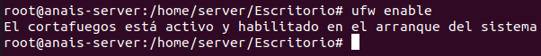
</center>

After we have the ufw enable and running we can see wich rules we have configurated using the command ``ufw status``, this command it's going to show us all the rules that we have configurated. In this case it's empty because we have no rules created.

<center>

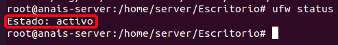
</center>

We needed to now our IP address, so we also use the command ``ip a``, we are goind to need it later.

<center>

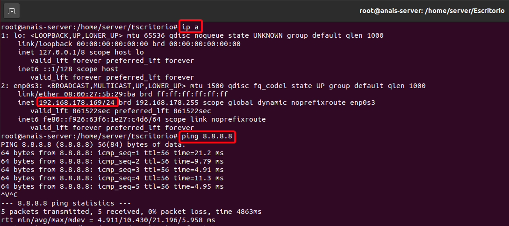
</center>

<center>

## **Create firewall rules to allow inbound and outbound traffic for specific ports, protocols, and IP addresses.**

</center>

<br>

Now that we have the UFW enable and without any rules allow we can start to create them.

 We are going to **allow one specific ip and deny a complete network** for the SSH protocol, **Deny the HTTP protocol** and **allow the HTTPS protocol** because it's more secure than the HTTP, and last but nor less important, we are going to **allow the MySQL protocol**, so we can connect remotly to our database.

<br>

## **- Protocol SSH:**

<br>

**SSH (Secure Shell)** is a secure network protocol that allows users to connect to a remote system securely and execute commands remotely. SSH is often used to connect to remote servers, whether to manage them, transfer files, or run applications on them.

To establish an SSH connection, it is necessary to have SSH client software installed on the local machine and enable the SSH service on the remote server. Then, a SSH client such as **PuTTY (on Windows)** or SSH command line (on Linux and macOS) can be used to connect to the remote server and access its resources.

The first rule it's going to be the ``"SSH"`` conexion by port 22, UFW we use the command ``"ufw allow ssh"``, with this line the rule will be allow and it will start to work inmediatly.

<center>

<br>

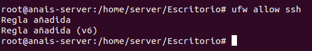

<br>

</center>

We used the command ``"ufw status numbered"`` so, now we can see the rule runnig and applied, till this momment we only have this rule in our firewall.

We can connect by **ssh** from another computer to this one using **ssh**.

<center>

<br>

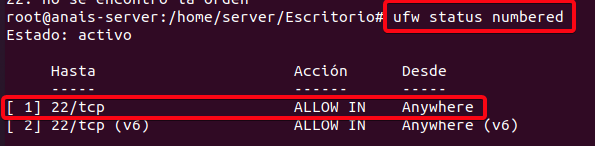

<br>

</center>

We can also deny or allow the ssh conection to an specific ip address or to an ip range in case you don't want someone in specific conecting to your computer or in case you only want to accept connection ssh just with one computer.

To allow just one specific ip address we create this rule, we used the command ``"sudo ufw allow from 192.168.43.19 proto tcp to any port 22"``.
So now, only the machine with that ip can make a ssh conection with us.

<br>

<center>

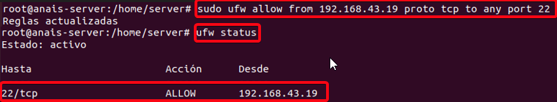

</center>
<br>

If we want to reject or deny the ssh conection we add the next rule ``"ufw deny from 192.168.43.0/24 to any port 22 proto tcp"``, with this command we will be rejecting all the specified network (192.168.43.0/24), except for the one that we accepted before (192.168.43.19), so we can be able to conect by ssh with the server.

Checked that the rules were apllied correctly using the command ``"ufw status numbered"``, we will see our rules running, so, now we can test them.

<br>

<center>

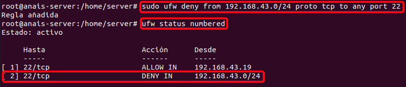
</center>

<br>

<center>

## **Test that the applied firewall rules are working correctly.**

</center>

<br>

## **- TESTING SSH PROTOCOL**

Now you can see that the rules about the **SSH Protocol** are working.

Only the machine with the ip address **192.168.43.19** can conect by ssh with our ubuntu machine, and the rest of machines with any ip address are going to be rejected.

To test if the rule ait`s working, the machine with the ip allow to ssh, in this case it's windows, so we had to install the program **putty** to make the conection by ssh with our ubuntu machine.

<br>

<center>

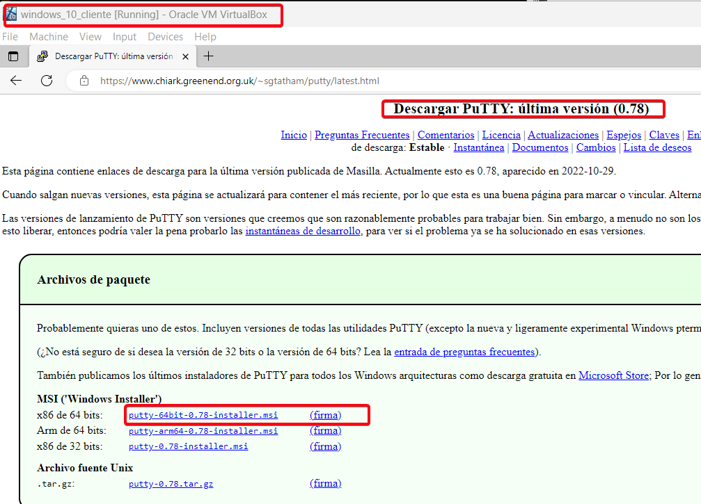
</center>

<br>

Insert the ip address of the machine that we want to connect with, in this case it's **192.168.43.193**, by **port 22**, connection type **"SSH"**, then you just have to open it.

<br>

<center>

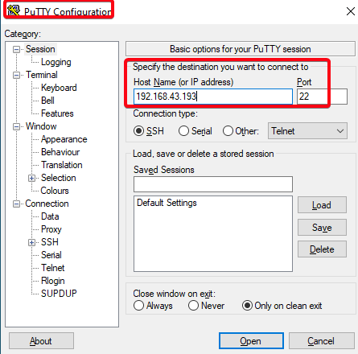 
</center>

<br>

We will need the ``"username"`` and ``"password"``, without this two requirements you can`t connect, after this it's connected to the server machine by ssh from the windows machine.

In the image below you can see that we are connected to the **server** wich use the ip address **192.168.43.193.**

<br>

<center>

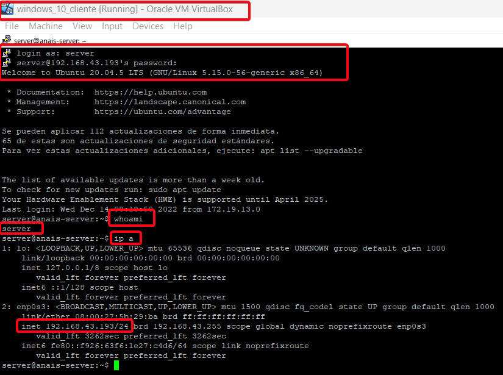
</center>

<br>

Then if we try to connect with another ip address machines that are not allowed, are actually rejected we are not going to be able to connect.

Below you will see an example. We tried to connect with an ubuntu machine using the ip **192.168.43.209**, you will see it was rejected, we couldn't connect to the server.

<br>

<center>

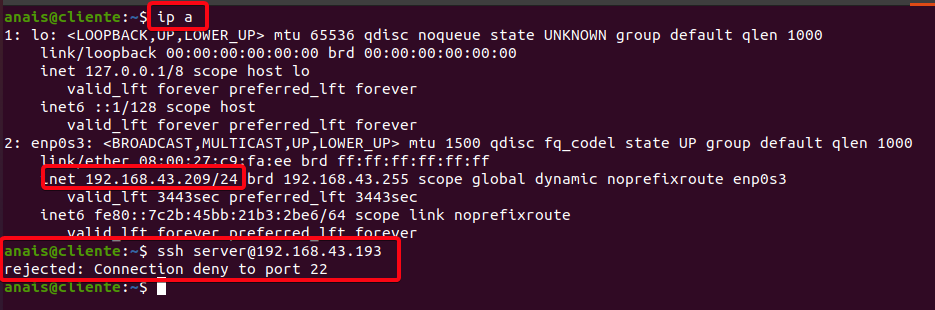
</center>

<br>

## **- Protocol HTTP:**

<br>

**HTTP (Hypertext Transfer Protocol)** is a communication protocol used on the **World Wide Web (WWW)** for transferring information between servers and clients.

The HTTP protocol is based on the client-server model, where a client (such as a web browser) sends a request to a server, and the server responds with a response that contains the requested resource (such as a web page).

**The HTTP protocol by default uses port 80** for communication between clients and servers.

When a client, such as a web browser, sends an HTTP request to a server, the request is sent through the server's port 80, unless another port is explicitly specified. Similarly, when a web server responds to an HTTP request, the response is sent back to the client through port 80, unless another port is specified in the response.

We are going to create the rule to deny the HTTP protocol, we have to make sure that the HTTP rule is denied in ufw. To do this, we run the following commands:

```
sudo ufw deny http
sudo ufw status numbered
```

<br>

<center>


</center>

<br>

After having the HTTP rule denied, we have to look for the entry for **"Apache"** and make sure that we have not access. In case you want to allow the http protocol in your sever, you can enable it with the following command: ``sudo ufw allow http`` 

## **- TESTING HTTP PROTOCOL**

<br>

To verify that the rule was applied correctly we have a couples of options:

**1) Accessing the website from a browser:** Open a web browser on your computer and type the IP address of your server or domain name in the browser address bar, followed by ":80".

```
http://192.168.43.193:80/
```

In the image below you can see the connection was rejected, so the firewall rule it's working.

<br>

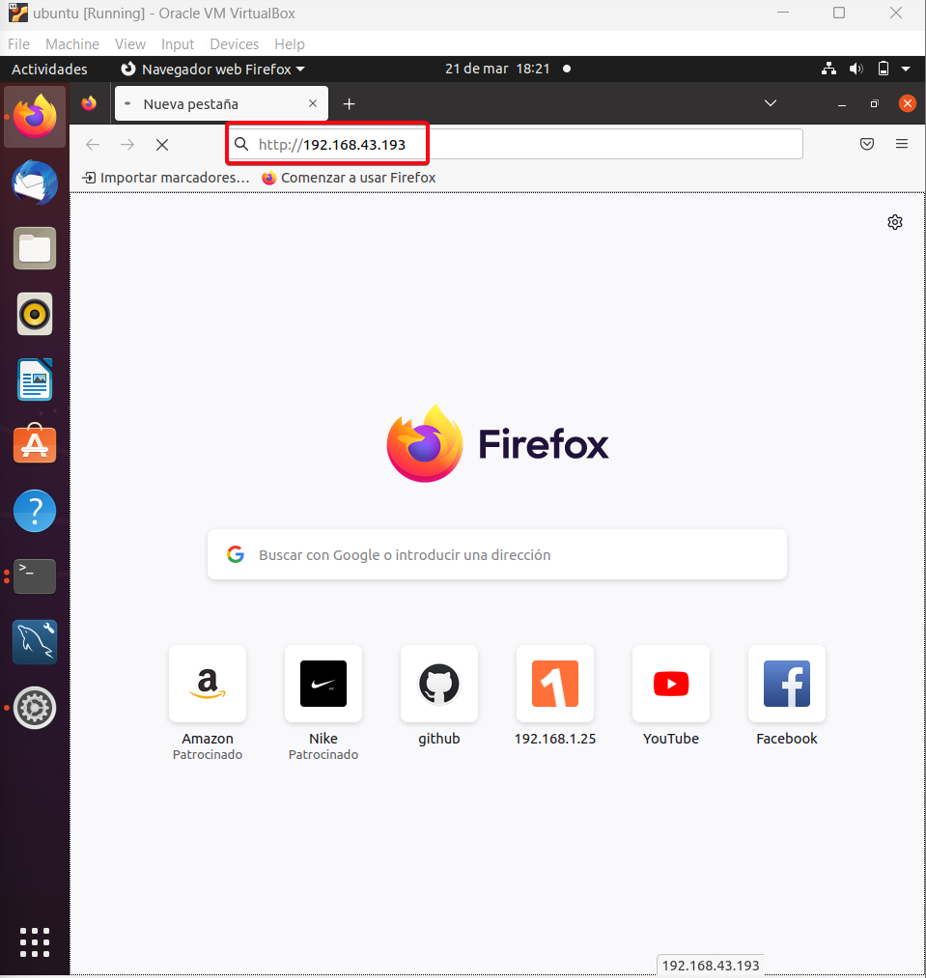
<br>

On this other imagen we tried to use the service from the server, so we can see that the apache service it's working because it's a local service connection.

```
http://localhost:80/
```

<br>

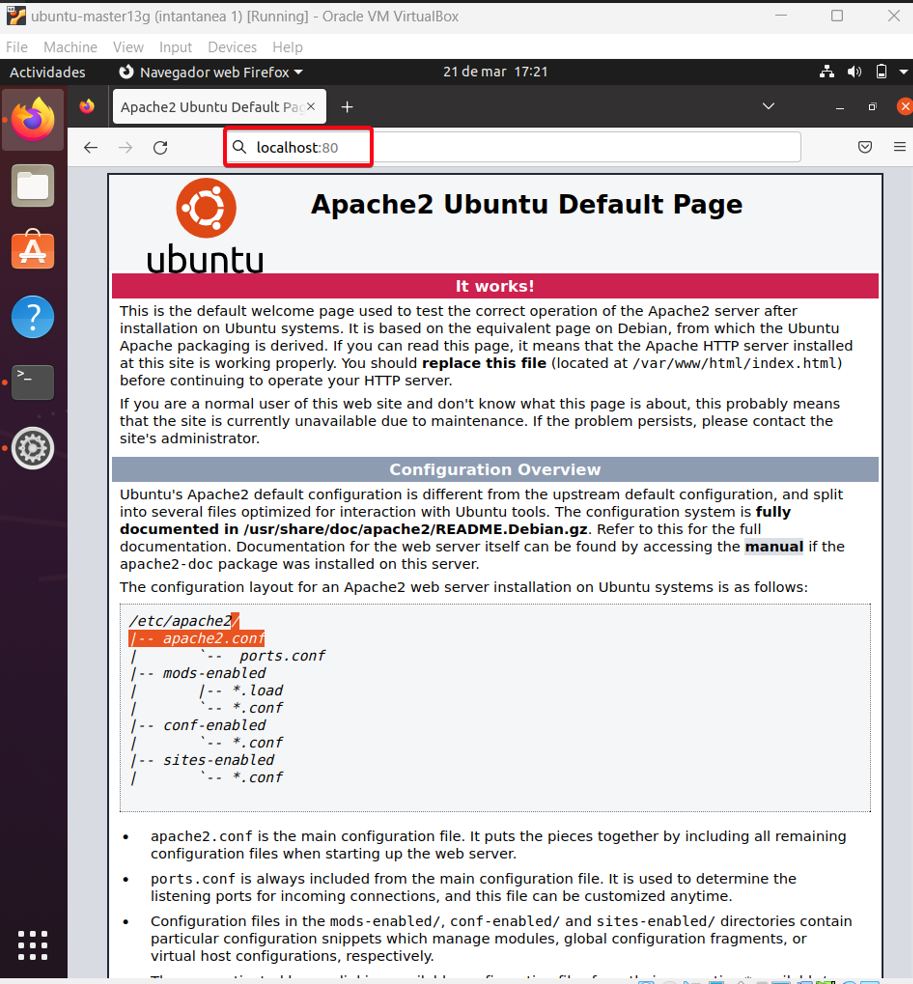
<br>

With this we proved that our firewall rules created are working correctly.


> **NOTE:** In case you  want to configure the HTTP rule manually using a different port, it can also be done with the following command, so you can specify the port that you want to use for it.
>
>```
>sudo ufw deny 8080/tcp
>```
>
>With this command we will disable incoming traffic through **port 8080** >for the **TCP protocol**.
>
>To be sure the rule was apllied correctly we use the command line ``sudo ufw status``, this command will show us the actual status of our ufw >rules,including the port 8080 if this one were configurated correctly.

<br>

## **- Protocol HTTPS:**

<br>

**HTTPS (Hypertext Transfer Protocol Secure)** is a communication protocol used to transfer data securely over the Internet. **HTTPS is a more secure version of the HTTP protocol**, which is used for transferring unencrypted data.

The main **difference between HTTP and HTTPS is that HTTPS uses an additional security layer** called SSL/TLS (Secure Sockets Layer/Transport Layer Security) to encrypt the data transmitted between the server and the client. This makes it more difficult for attackers to intercept and read the data while it is being transferred between the client and server.

HTTPS is commonly used in financial transactions, online purchases, and in any situation where secure data transfer is required. Websites that use HTTPS have a lock icon in the browser address bar and their **URL begins with "https://" instead of "http://"**. 

> It is important to note that other protocols, such as HTTPS, also use port 80 by default for communication with the server, but **port 443 is typically used for secure communication over HTTPS**.

We are going to add this rule to our firewall, first of all we need to verify that the rule to the **port 443** it's enabled in ufw.

```
sudo ufw status ---> To check if the rule exist.
sudo ufw allow 443/tcp ---> To add the rule to our firewall and make the port 443 enable.
```
Once we created the rule for protocol HHTPS using the port 443 we can check it using again the command ``sudo ufw status`` and this time we have to be ables to see the port an protocol being able and open to use.

<br>

<center>

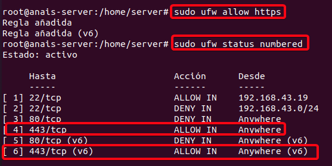
</center>

<br>

With this rule working we can use the browser in a more secure way and create web domains more secures than with the HTTP protocol.

<br>

## **- TESTING HTTPS PROTOCOL**

<br>

To check and prove if the firewall rule that we added about the **HTTPS protocol** it's working we can go to the browser and now we are going to be ables to open a HTTPS direction, this give us more security and a safe domain, it should appear the **https** before the url direction, in this case we used:

```
https://192.168.43.193:443
```

We can see below that the connectioin it's not complete secure, this it's because we are using a demo SSL certificate to prove the connection and if the firewall rule it's working.

<br>

<center>

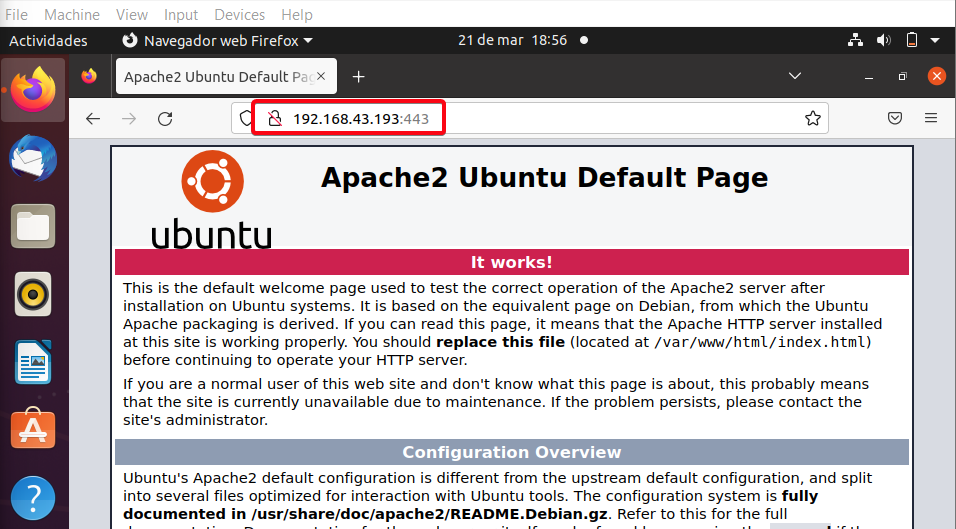
</center>

<br>

## **- Protocol MySQL:**
<br>

Enabling **port 3306** in UFW (Uncomplicated Firewall) in Ubuntu will let us allow incoming connections to a **MySQL database** server on that port.

**Port 3306 is the default port used by MySQL** to accept incoming network connections, and if this port is not open in the firewall, external clients will not be able to connect to the MySQL database server.

With this protocol we can allow the remote access to our database of MySQL, so it's easier to connect and modify it for externals clients.

To allow this protocol we applied the command ``sudo ufw allow mysql`` and we checked that was correctly apllied using the command ``ufw status numbered``

<br>

<center>

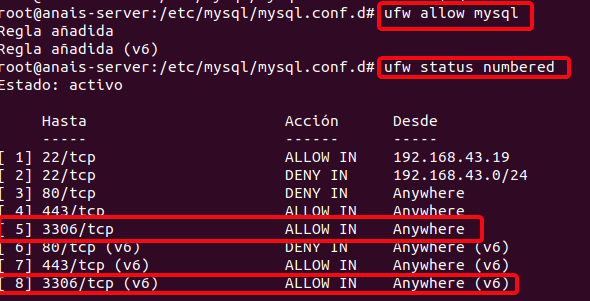
</center>

<br>

## **TESTING MySQL PROTOCOL**
<br>

To prove that the firewall rule created it's working we are going to connect to the Mysql database from another machine, using the command:``mysql -u user -p -h ipserver``

```
mysql -u anais -p -h 192.168.43.193
```

<br>

<center>

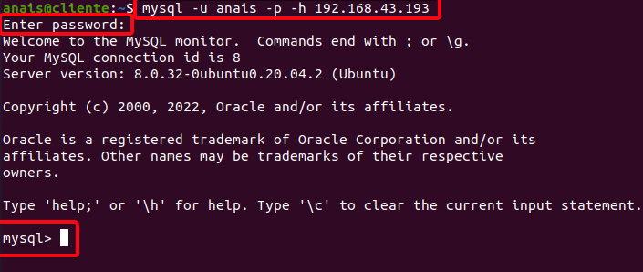
</center>

<br>

**Once port 3306 has been enabled on the UFW, external clients should be able to connect to the MySQL database server on that port**. It is important to note that by allowing traffic on a port, you are opening the door to potential security threats, so it is important to ensure that other appropriate security measures are in place to protect the MySQL database server.

We were able to connect to the mysql database remotely, for this **we need to know the IP address of the server and the password**, without these two requirements we could not connect.

<br>

---
<h1 align="center">WINDOWS. <a name="id4.2"></a><h1>

In this part we are going to create and configurate the same firewall rules than we made in ubuntu but in Windows.

## **Firewall installation and configuration.**

Windows comes with a built-in firewall that can be used to protect your system from online attacks, so in the case of windows we don't have to install the firewall from scratch, we simply have to activate it.

To activate the Windows Firewall we have to **access the Control Panel** from the Start menu. Then, click on **"System and Security"** and select **"Windows Firewall"** from the options. In the next window, **click on "Turn Windows Firewall on or off"**. After that, check the box for **"Turn on Windows Firewall"** for each network option and click "OK". This will enable the Windows Firewall for your system and help prevent unauthorized access or harmful activity.

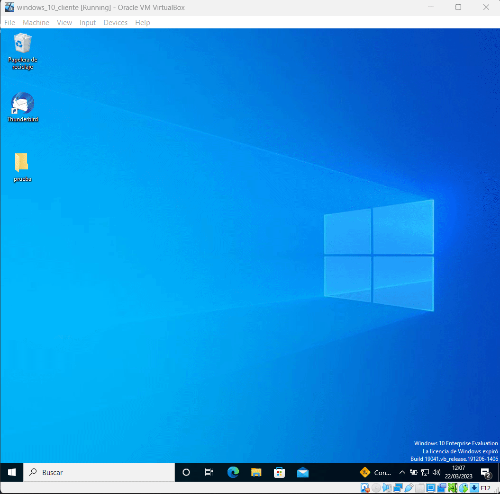

Now that we have the firewall active and working we can start crating rules on it.

## **Creation of firewall rules.**

## **Test that the applied firewall rules are working correctly.**


<br>

## ***Closure***. <a name="id5"></a>

</center>

<br>

