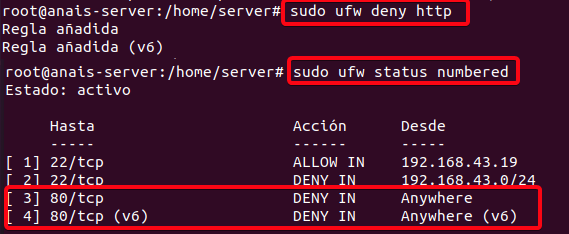
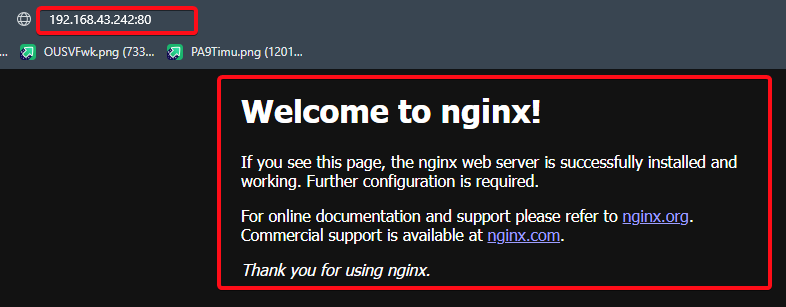

<center>

# Task2: Implementing Firewall Rules

</center>

***Author:*** Anais G. Aguiar Contreras.

***Company:*** EUtech Assignments.

***Date:*** 24th March of 2023.

## **Index**

+ [Description](#id1)
+ [Requirements](#id2)
+ [Used tools](#id3)
+ [Development](#id4)
    + [Linux](#id4.1)
    + [Windows](#id4.2)
+ [Closure](#id5)

<center>

## ***Description***. <a name="id1"></a>

</center>

<br>

In this guide, we will walk you through the process of installing and configuring a firewall on both Windows and Linux operating systems. We will cover the basic concepts of firewall security, the different types of firewalls available, and the step-by-step process for installing and configuring a firewall on both operating systems. By the end of this guide, you will have a solid understanding of how to install and configure a firewall to secure your system and protect it from cyber threats.

UFW allows for a wide range of firewall configurations, including the ability to allow or block incoming and outgoing traffic based on source and destination IP addresses, ports, and protocols. It also supports advanced configurations such as logging, rate limiting, and connection tracking.

To this project, we have been hired as Network Security Engineers for a small company. The company has a network infrastructure consisting of multiple devices, including servers, switches, and routers. Your task is to configure and implement firewall rules to secure the network infrastructure.

<br>

<center>

## ***Requirements.*** <a name="id2"></a>

</center>

<br>

You have to configure and implement firewall rules to secure the network infrastructure, but you have some requirements that you must apply in the project.

Requirements that you have to include in this proyect are the next ones:

<br>

* Install and configure a firewall on both Windows and Linux operating systems.

<br>

* Create firewall rules to allow inbound and outbound traffic for specific ports, protocols, and IP addresses.

<br>

* Test the firewall rules to ensure that they are working correctly.

<br>

* Create a report detailing the configuration and implementation of the firewall rules.

<br>

<center>

## ***Used tools.*** <a name="id3"></a>

</center>

 <br>

We will use two differents Virtual Machines

|   MV  |      OS      |     Version     |         IP       |   ROL   |
|-------|--------------|-----------------|------------------|---------|
|   1   |  Windows 10  | Enterprice 2016 |  192.168.43.19   | Cliente |
|   2   |    Ubuntu    |   Ubuntu 20.04  |  192.168.43.193  | Cliente |
|   3   |  Windows 10  | Windows 10 Home |  192.168.43.242  | Cliente |

<br>

### ***Development.*** <a name="id4"></a>

<center>

<br>

## ***Install and configure a firewall on both Windows and Linux operating systems.***

</center>

<br>

We started with all the firewall installations and configurations of Linux, in this case we used an Ubuntu machine to create all the rules that we wanted to allow or deny inbound and outbound traffic for specific ports, protocols, and IP addresses.

We worked with SSH, HTTP, HTTPS and Mysql protocols.

Then we worked with the same firewall rules but in windows.

<br>

<h1 align="center">UBUNTU. <a name="id4.1"></a></h1>

<br>

We first started with Linux. First of all we checked that the ufw was installed and running, if it is not we can install it using the command ``"sudo apt-get install ufw"``, in our case it was already installed. We used the command ``"ufw status"`` to check if it was running, in case the ufw is installed but not running, we can start it with the command `"ufw enable"`.

```
sudo apt-get install ufw ----> To Install.

sudo ufw status ----> To check the status.

sudo ufw enable ----> To start it.
```
<center>


</center>

After we had the ufw enabled and running, we checked to see wich rules we have configurated using the command ``ufw status``, this command is going to show us all the rules that we have configurated. In this case it's empty because we have no rules created.

<center>


</center>

We needed to know our IP address, so we also used the command ``ip a``, because we are going to need it later.

<center>


</center>

<center>

## **Create firewall rules to allow inbound and outbound traffic for specific ports, protocols, and IP addresses.**

</center>

<br>

Now that we have the UFW enabled and without any rules allowed, we can start to create them.

 We are going to **allow one specific ip and deny a complete network** for the SSH protocol, **Deny the HTTP protocol** and **allow the HTTPS protocol** because it's more secure than the HTTP, and last but not less important, we are going to **allow the MySQL protocol**, so we can connect remotly to our database.

<br>

## **- Protocol SSH:**

<br>

**SSH (Secure Shell)** is a secure network protocol that allows users to connect to a remote system securely and execute commands remotely. SSH is often used to connect to remote servers, whether to manage them, transfer files, or run applications on them.

To establish an SSH connection, it is necessary to have SSH client software installed on the local machine and enable the SSH service on the remote server. Then, a SSH client such as **PuTTY (on Windows)** or SSH command line (on Linux and macOS) can be used to connect to the remote server and access its resources.

The first rule is going to be the ``"SSH"`` connection by port 22, UFW so we use the command ``"ufw allow ssh"``. With this line the rule will be applied and it will start to work inmediatly.

<center>

<br>


<br>

</center>

We used the command ``"ufw status numbered"`` , so now we can see the rule running and applied. Till this momment, we only have this rule in our firewall.

We can connect by **ssh** from another computer to this one using **ssh**.

<center>

<br>


<br>

</center>

We can also deny or allow the "ssh" connection to a specific ip address or to an ip range in case you don't want someone in specific connecting to your computer or in case you only want to accept connection "ssh" just with one computer.

To allow just one specific ip address we created this rule, we used the command ``"sudo ufw allow from 192.168.43.19 proto tcp to any port 22"``.
So now, only the machine with that ip can make a ssh connection with us.

<br>

<center>


</center>
<br>

If we wanted to reject or deny the ssh connection, we added the next rule ``"ufw deny from 192.168.43.0/24 to any port 22 proto tcp"``, with this command we will be rejecting all the specified network (192.168.43.0/24), except for the one that we accepted before (192.168.43.19), so we can connect by ssh with the server.

We checked that the rules were apllied correctly using the command ``"ufw status numbered"``, we wanted to see our rules running, so that we can test them.

<br>

<center>


</center>

<br>

<center>

## **Test that the applied firewall rules are working correctly.**

</center>

## **- TESTING SSH PROTOCOL**

Now you can see that the rules of the **SSH Protocol** are working.

Only the machine with the ip address **192.168.43.19** can conect by ssh with our ubuntu machine, and the rest of the machines with any other ip address are going to be rejected.

To test if the rule is working, which is the machine with the ip allowed to ssh, in this case it's windows, we had to install the program **putty** to test the conection by ssh with our ubuntu machine.

<br>

<center>


</center>

<br>

Insert the ip address of the machine that we want to connect with, in this case it's **192.168.43.193**, by **port 22**, connection type **"SSH"**, then you just have to open it.

<br>

<center>

 
</center>

<br>

We will need the ``"username"`` and ``"password"``, without these two requirements you can`t connect, after this is connected to the server machine by ssh from the windows machine.

In the image below you can see that we are connected to the **server** wich use the ip address **192.168.43.193.**

<br>

<center>


</center>

<br>

Then if we try to connect with another ip address machines that are not allowed, we can see that they are actually rejected and we are not going to be able to connect.

Below you will see an example. We tried to connect with an ubuntu machine using the ip **192.168.43.209**, you will see it was rejected, we couldn't connect to the server.

<br>

<center>


</center>

<br>

## **- Protocol HTTP:**

<br>

**HTTP (Hypertext Transfer Protocol)** is a communication protocol used on the **World Wide Web (WWW)** for transferring information between servers and clients.

The HTTP protocol is based on the client-server model, where a client (such as a web browser) sends a request to a server, and the server responds with a response that contains the requested resource (such as a web page).

**The HTTP protocol by default uses port 80** to communication between clients and servers.

When a client, such as a web browser, sends an HTTP request to a server, the request is sent through the server's port 80, unless another port is explicitly specified. Similarly, when a web server responds to an HTTP request, the response is sent back to the client through port 80, unless another port is specified in the response.

We are going to create the rule to deny the HTTP protocol, we have to make sure that the HTTP rule is denied in ufw. To do this, we run the following commands:

```
sudo ufw deny http
sudo ufw status numbered
```

<br>

<center>


</center>

<br>

After having the HTTP rule denied, we have to look for the entry for **"Apache"** and make sure that we do not have access. In case you want to allow the http protocol in your sever, you can enable it with the following command: ``sudo ufw allow http`` 

## **Test that the applied firewall rules are working correctly.**

## **- TESTING HTTP PROTOCOL**

<br>

To verify that the rule was applied correctly we have a couples of options:

**1) Accessing the website from a browser:** Open a web browser on your computer and type the IP address of your server or domain name in the browser address bar, followed by ":80".

```
http://192.168.43.193:80/
```

In the image below you can see the connection was rejected, it never connected, so the firewall rule is working.

<br>


<br>

In this other image, we tried to use the service from the server, so we can see that the apache service is working because it's a local service connection, you can see that it's using port 80.

```
http://localhost:80/
```

<br>


<br>

With this we proved that our firewall rules created are working correctly.


> **NOTE:** In case you  want to configure the HTTP rule manually using a different port, it can also be done with the following command, so you can specify the port that you want to use for it.
>
>```
>sudo ufw deny 8080/tcp
>```
>
>With this command we will disable incoming traffic through **port 8080** >for the **TCP protocol**.
>
>To be sure the rule was apllied correctly we use the command line ``sudo ufw status``, this command will show us the actual status of our ufw >rules,including the port 8080 if this one were configurated correctly.

<br>

## **- Protocol HTTPS:**

<br>

**HTTPS (Hypertext Transfer Protocol Secure)** is a communication protocol used to transfer data securely over the Internet. **HTTPS is a more secure version of the HTTP protocol**, which is used for transferring unencrypted data.

The main **difference between HTTP and HTTPS is that HTTPS uses an additional security layer** called SSL/TLS (Secure Sockets Layer/Transport Layer Security) to encrypt the data transmitted between the server and the client. This makes it more difficult for attackers to intercept and read the data while it is being transferred between the client and server.

HTTPS is commonly used in financial transactions, online purchases, and in any situation where secure data transfer is required. Websites that use HTTPS have a lock icon in the browser address bar and their **URL begins with "https://" instead of "http://"**. 

> It is important to note that other protocols, such as HTTPS also use port 80 by default to communicate with the server, but **port 443 is typically used for secure communication over HTTPS**.

We are going to add this rule to our firewall, but first of all we need to verify that the rule to the **port 443** is enabled in ufw.

```
sudo ufw status ---> To check if the rule exists.
sudo ufw allow 443/tcp ---> To add the rule to our firewall and enable the port 443.
```
Once we created the rule for protocol HHTPS using the port 443 we can check it using again the command ``sudo ufw status`` and this time we have to be able to see the port and protocol enabled and open to use.

<br>

<center>


</center>

<br>

With this rule working we can use the browser in a more secure way and create web domains more secure than with the HTTP protocol.

<br>

## **Test that the applied firewall rules are working correctly.**

## **- TESTING HTTPS PROTOCOL**

<br>

To check and prove if the firewall rule that we added for the **HTTPS protocol** is working, we can go to the browser and now we are going to be able to open a HTTPS direction. This gives us more security and a safe domain, it should appear **https** before the url direction, in this case we used:

```
https://192.168.43.193:443
```

We can see below that the connection is not completely secure, this is because we are using a demo SSL certificate to approve the connection and approve if the firewall rule is working.

<br>

<center>


</center>

<br>

## **- Protocol MySQL:**
<br>

Enabling **port 3306** in UFW (Uncomplicated Firewall) in Ubuntu will let us allow incoming connections to a **MySQL database** server on that port.

**Port 3306 is the default port used by MySQL** to accept incoming network connections, and if this port is not open in the firewall, external clients will not be able to connect to the MySQL database server.

With this protocol we can allow the remote access to our database of MySQL, so it's easier to connect and modify it for external clients.

To allow this protocol we applied the command ``sudo ufw allow mysql`` and we checked that was correctly apllied using the command ``ufw status numbered``

<br>

<center>


</center>

<br>

## **Test that the applied firewall rules are working correctly.**

## **TESTING MySQL PROTOCOL**
<br>

To prove that the firewall rule created is working we are going to connect to the Mysql database from another machine, using the command:``mysql -u user -p -h ipserver``

```
mysql -u anais -p -h 192.168.43.193
```

<br>

<center>


</center>

<br>

**Once port 3306 has been enabled on the UFW, external clients should be able to connect to the MySQL database server on that port**. It is important to note that by allowing traffic on a port, you are opening the door to potential security threats, so it is important to ensure that other appropriate security measures are in place to protect the MySQL database server.

We were able to connect to the mysql database remotely. To do so, **we need to know the IP address of the server and the password**. Without these two requirements we could not connect.

<br>

<h1 align="center">Windows. <a name="id4.2"></a></h1>

<br>

In the case of windows, its firewall functions are very different from those of ubuntu as windows is much more automatic, every time you install a program, windows opens the ports it needs to work automatically, which makes the firewall configuration a bit useless, in my opinion with windows and its firewall, the most convenient is to override ports or specific entries.

In this case we enabled the ssh connection in both directions, and the HTTP protocol.


## **Firewall installation and configuration.**

In this part created and configurated a couple of firewall rules in Windows.

Windows comes with a built-in firewall that can be used to protect your system from online attacks, so in the case of windows we don't have to install the firewall from scratch, we simply have to activate it.

To activate the Windows Firewall we have to **access the Control Panel** from the Start menu. Then, click on **"System and Security"** and select **"Windows Firewall"** from the options. In the next window, **click on "Turn Windows Firewall on or off"**. After that, check the box for **"Turn on Windows Firewall"** for each network option and click "OK". This will enable the Windows Firewall for your system and help prevent unauthorized access or harmful activity.


Now that we have the firewall active and working we can start create rules on it.

## **Creation of firewall rules.**
<br>

**- SSH PROTOCOL.**

First of all we have to check if we have the SSH intalled, if we don't have it, we can install it using the command ``winget install Microsoft.OpenSSH.Beta``

Now we can start to create the rule.

To allow and create rules with the Windows Firewall we just have to click on:

1) **"Advanced settings"** in the left sidebar 

2) Then Select **"Inbound Rules"**. 

3) After, click on "New Rule" in the right sidebar, and follow the prompts to select **"Port"**, choose **"TCP"** as the protocol type, and enter **"22"** as the port number. 

4) Select **"Allow the connection"** and **all profile options**, and then give a name to the new rule, we called it **"conexion SSH"**, then, just have to click **"Finish"** to complete the process. With these steps, we are already allowing the use of SSH connection through the Winodws firewall.


Another and easier way to install OpenSSH in Windows is by graphical environment, below you can see how to install it. Using this option, windows open the 22 port automatically, so we don't have to configurate and create the rule ourself.

To install OpenSSH by this option we used a Windows 10 machine.


Once we have installed it, we have to active the SSH service using the services options of windows. After activating it we can check if it's active using the commmand ``Get-Service -Name *ssh*``


> **NOTE:** In case that you as a server want to just allow the connection from your machine to another one, you must install the **clientSSH** and in case you only want to allow others to connect to your machine but you cannot connect to other machines you should install only **ServerSSH.** 

> In our case we installed both because we wanted to allow both connections.

We also have to check if we have the port open using the command ``netstat -bano | more``


<br>

## **Test that the applied firewall rules are working correctly.**

## **TESTING SSH PROTOCOL**

With the rule created we can try the connection to check if the rule is actually working correctly, our machine is using the ip address **192.168.43.242,**. Now we are able to connect through ssh from our windows machine to any other machine knowing the ip address, the username and the password.

This time we connected **from our machine to another Windows machine** using SSH. To connect we used the command ``ssh user@ip-address``

```
ssh cristian@192.168.43.236
```


And here we tried to connect **from another Windows machine to our machine** using the same command we used before.

```
ssh anais@192.168.43.242
```


With this, we proved that the ssh protocol is working in our windows firewall.

<br>

**- HTTP PROTOCOL**

To allow the HTTP protocol, this time we used another option to enable the **port 80** wich is the port that use the **HTTP protol**. To configurate the firewall using this option we have to **configurate the docker file** first using the next lines:

```dockerfile
FROM nginx
EXPOSE 80
```
It will look like this:


Once we have the docker file configurated, we have to create a script to generate the respective container in nginx.


```ps1
docker build -t anais/nginx . # To create the image from our docker file, the ended point at the end it's indespensable 
docker run -d -p 80:80 anais/nginx  # To generate a container of the image created using the port 80:80
```

Now we have to execute the ```main.ps1`` script.


**Docker enables the ports automatically** for a short time, so we only need to activate the port in the firewall if we configurated the rule in the clasic way.

After following all the steps we have the HTTP protocol working and open with the port 80.

> NOTE: In case of configurating the rule in the classic way, we have to active the port 80 using the firewall configurations.

<br>

## **Test that the applied firewall rules are working correctly.**


## **TESTING HTTP PROTOCOL**

To prove that our firewall rule is working even when we configurated it in a different way, we can use the command ``docker ps``. This command is going to show us the containers that we have running and the ports that we are using.


After we checked that the port is open, we can go to the browser and using the ip of our machine **(192.168.43.242)** nginx it will be working using the **port 80.**

```
192.168.43.424:80
```



## **- HTTPS Protocol**

We tried to configurate this rule, but it wasn't working because we are using local machines and we don't have a register domain to generate the **SSL certificate**, so what we did was enable the **port 443** but in our case we cannot check if it's working correctly.

Even tho, to configurate this rule and open the port we just have to create a new inbound rule in our firewall.


if we had the ssl certificate we could check its operation, thus having a more secure connection, in case of having the certificate, to check its operation we would simply have to go to the browser and with the **ip of the server** where the rule was created followed by the port or using the **"https://"** followed by the ip, we would already have the connection. 

Examples below:

```
ip-server:443

https://ip-server
```

## ***Closure***. <a name="id5"></a>

</center>

<br>

The Ubuntu and Windows firewalls have similarities in their abilities to **block unauthorized traffic** and **control access to system services**, but also have notable differences. The Ubuntu firewall is based on ip tables and uses rules to filter network traffic, while the Windows firewall uses the **Windows Firewall with Advanced Security and has a more user-friendly GUI**. Windows firewall is enabled by default in all versions, while **Ubuntu firewall may not be enabled by default**. Configuring the Windows firewall may be easier for less experienced users due to its intuitive GUI, while the Ubuntu firewall may be more complex due to its rule-based configuration. Both firewalls are effective in protecting against external threats, and the choice between them depends on the specific needs and skills of the system administrator.
